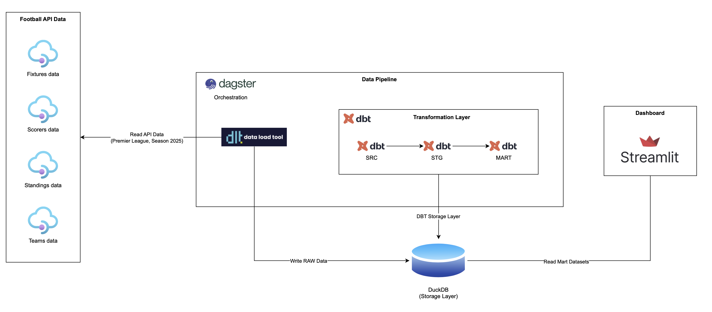

# Premier League Data Platform - MVP

## Project Overview

This is an MVP implementation of a Premier League Data Platform that demonstrates modern data engineering principles through an automated ELT pipeline.

## Architecture

```
API-Football → dlt → DuckDB (RAW) → dbt → Dagster → Streamlit
```


## Project Structure

```
PL_dashboard/
├── dashboard_streamlit/        # Streamlit UI
│   ├── app.py
│   ├── pages/
│   └── components/
│
├── ingestion/                  # dlt ingestion pipelines
│   ├── pipelines/
│   │   ├── teams_pipeline.py
│   │   ├── fixtures_pipeline.py
│   │   ├── standings_pipeline.py
│   │   ├── scorers_pipeline.py
│   │   └── players_pipeline.py
│   │
│   ├── sources/
│   │   └── api_football.py
│   │
│   ├── utils/
│   │   ├── duckdb_setup.py
│   │   └── __init__.py
│   │
│   └── __init__.py
│
├── orchestration/              # Dagster
│   ├── assets.py
│   ├── definitions.py
│   └── __init__.py
│
├── dbt/                        # dbt project
│   ├── models/
│   ├── macros/
│   ├── dbt_project.yml
│   └── profiles.yml
│
├── duckdb/                     # Local DuckDB storage
│   └── football.duckdb
│
├── exploration/                # Notebooks / experiments
│   └── duckdb_test.ipynb
│
├── docs/                       # Documentation
│
├── utils/                      # Shared helpers (optional)
│
├── dagster_defs.py             # Dagster entrypoint
├── pyproject.toml
├── uv.lock
├── .env
├── .gitignore
└── README.md

```

## Components

### 1. Data Ingestion (dlt)
- `fixtures_pipeline`: Ingests fixture data
- `teams_pipeline`: Ingests team data
- `standings_pipeline`: Ingests standings data
- `scorers_pipeline`: Ingests top scorers data
- `players_pipeline`: Ingests players data
### 2. Storage (DuckDB)
- Single DuckDB database
- RAW schema for storing raw API responses

### 3. Transformation (dbt)
- **src**: Source models from RAW
- **stg**: Staging/cleaned models
- **mart**: Analytical models
  - `mart_team_kpi`: Team KPIs
  - `mart_player_kpi`: Player KPIs

### 4. Orchestration (Dagster)
- `pl_mvp_pipeline`: Main pipeline job
- Runs dlt ingestion + dbt transformations

### 5. Visualization (Streamlit)
- **League Overview**: League-wide statistics
- **Team Overview**: Team-specific KPIs

## Data Sources

- **League**: Premier League (ID: 39)
- **Season**: 2025/2026
- **API**: API-Football (v3.football.api-sports.io)

## Setup

1. Create and activate a virtual environment:

   ```
   uv init
   ```
2. Install dependencies:
   ```bash
   uv sync
   ```

3. Configure environment variables in `.env`:
   ```
   API_FOOTBALL_KEY=your_api_key_here
   ```

4. Run the pipeline:
   ```bash
   dagster dev -m dagster_defs
   ```
   
   Or if auto-discovery works:
   ```bash
   dagster dev
   ```

5. Launch Streamlit dashboard:
   ```bash
   streamlit run dashboard_streamlit/app.py
   ```

## MVP Scope

**Included:**
- Fixtures, Teams, Standings, Top Scorers and players data
- Basic team and player KPIs
- Automated ELT pipeline

**Out of Scope:**
- Advanced statistics (xG, injuries, cards)
- CI/CD pipelines
- Forecasting or ML
- Multi-league support

## Success Criteria

- ✅ End-to-end pipeline runs successfully
- ✅ KPIs visible in Streamlit
- ✅ Clear architecture explanation

