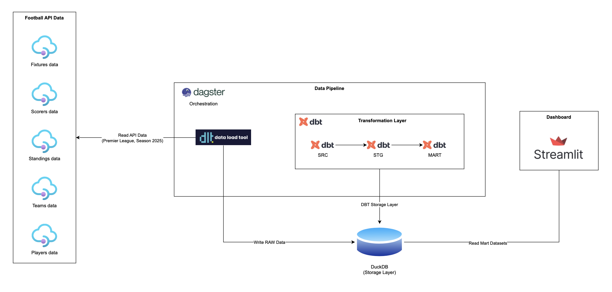

# Premier League Data Platform - MVP

## Project Overview

This is an MVP implementation of a Premier League Data Platform that demonstrates modern data engineering principles through an automated ELT pipeline.

## Architecture

```
API-Football → dlt → DuckDB (RAW) → dbt → Dagster → Streamlit
```


## Project Structure

```
PL_DASHBOARD/
├── assets/                         # Static assets 
│   ├── hero-banner.png             # Homepage image
│   └── architecture.png            # System architecture diagram
│
├── dashboard_streamlit/            # Streamlit 
│   ├── app.py                      # Main Streamlit entrypoint
│   ├── data/                       # Cached / prepared datasets for the UI
│   ├── views/                      # 
│   │   ├── home.py                 # Homepage 
│   │   ├── league_overview.py      # League-level analytics
│   │   ├── team_overview.py        # Team-level analytics
│   │   └── source_datasets.py      # Data source overview / metadata
│   │
│   └── README.md                   # Dashboard-specific documentation
│
├── ingestion/                      # Data ingestion layer (dlt pipelines)
│   ├── pipelines/                  # API ingestion pipelines
│   ├── sources/                    # External data sources (API-Football)
│   ├── utils/                      # Ingestion helpers (DuckDB setup, etc.)
│   └── __init__.py
│
├── orchestration/                  # Workflow orchestration (Dagster)
│   ├── assets.py                   # Dagster asset definitions
│   ├── definitions.py              # Dagster Definitions
│   └── __init__.py
│
├── dbt/                            # Transformation layer (dbt)
│   ├── models/                     # Analytics models
│   ├── macros/                     
│   ├── dbt_project.yml
│   └── profiles.yml
│
├── duckdb/                         # Local DuckDB storage
│   └── football.duckdb
│
├── exploration/                    # Notebooks
│
├── docs/                           # Documentation
│
├── dagster_defs.py                 # Dagster entrypoint
├── pyproject.toml                  
├── uv.lock                         
├── .env                            # Environment variables (ignored in git)
├── .gitignore
├── .python-version                 
└── README.md


```

## Components

### 1. Data Ingestion (dlt)
- `fixtures_pipeline`: Ingests fixture data
- `teams_pipeline`: Ingests team data
- `standings_pipeline`: Ingests standings data
- `scorers_pipeline`: Ingests top scorers data
- `players_pipeline`: Ingests players data
### 2. Storage (DuckDB)
- Single DuckDB database
- RAW schema for storing raw API responses

### 3. Transformation (dbt)
[dbt/README.md](dbt/README.md)
- **src**: Source models from RAW
- **stg**: Staging/cleaned models
- **mart**: Analytical models
  - `mart_team_kpi`: Team KPIs
  - `mart_player_kpi`: Player KPIs

### 4. Orchestration (Dagster)
[orchestration/README.md](orchestration/README.md)
- `pl_mvp_pipeline`: Main pipeline job
- Runs dlt ingestion + dbt transformations

### 5. Visualization (Streamlit)
[dashboard_streamlit/README.md](dashboard_streamlit/README.md)
- **League Overview**: League-wide statistics
- **Team Overview**: Team-specific KPIs


## Data Sources

- **League**: Premier League (ID: 39)
- **Season**: 2025/2026
- **API**: API-Football (v3.football.api-sports.io)

## Setup

1. Create and activate a virtual environment:

   ```
   uv init
   ```
2. Install dependencies:
   ```bash
   uv sync
   ```

3. Configure environment variables in `.env`:
   ```
   API_FOOTBALL_KEY=your_api_key_here
   ```

4. Run the pipeline:
   ```bash
   dagster dev -m dagster_defs
   ```

5. Launch Streamlit dashboard:
   ```bash
   uv run streamlit run dashboard_streamlit/app.py
   ```

## MVP Scope

**Included:**
- Fixtures, Teams, Standings, Top Scorers and players data
- Basic team and player KPIs including bookings
- Automated ELT pipeline

**Out of Scope:**
- Advanced statistics (xG, injuries)
- CI/CD pipelines
- Forecasting or ML
- Multi-league support

## Success Criteria

- ✅ End-to-end pipeline runs successfully
- ✅ KPIs visible in Streamlit
- ✅ Clear architecture explanation

